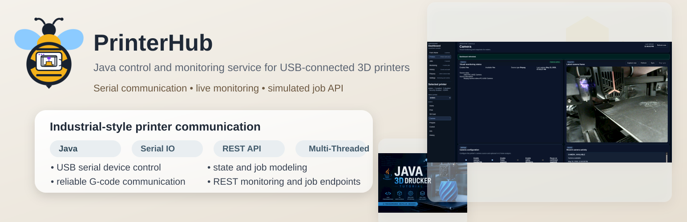
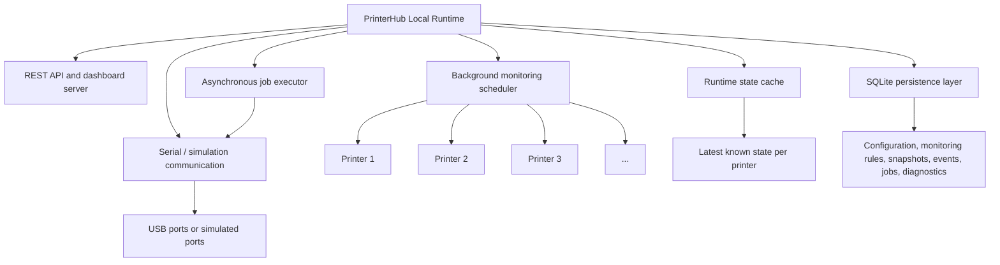
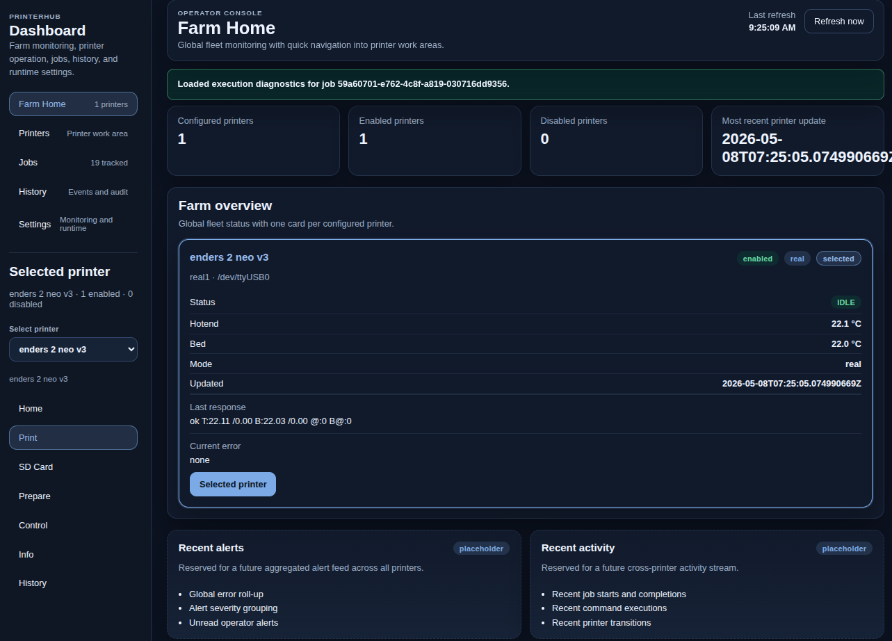
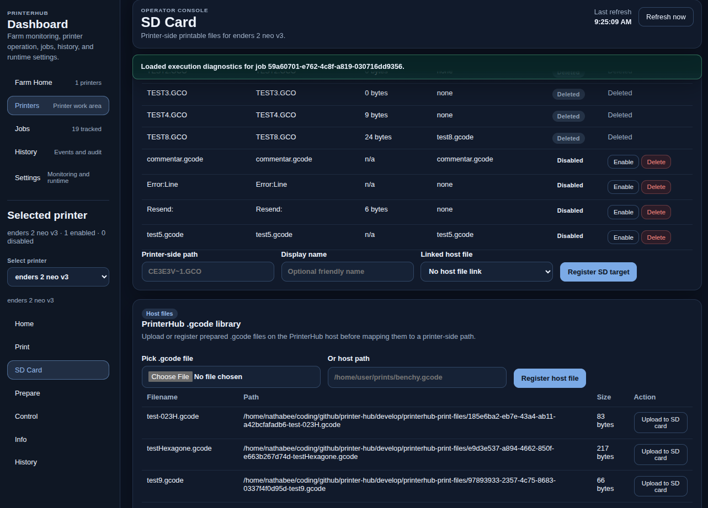
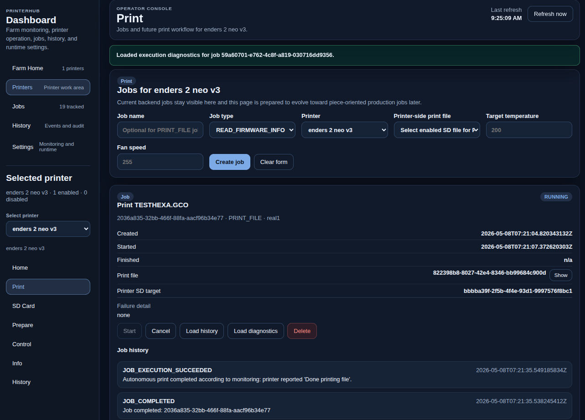
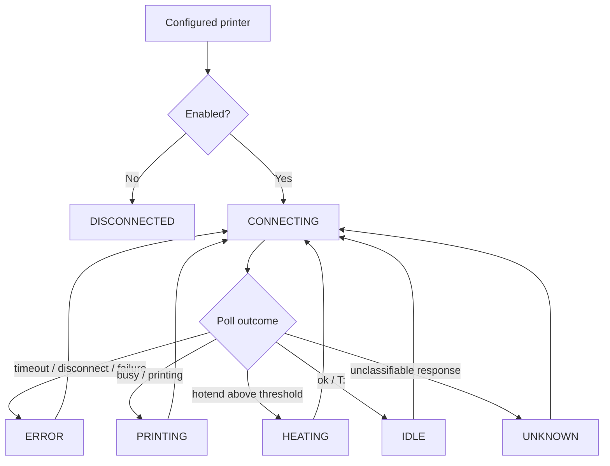
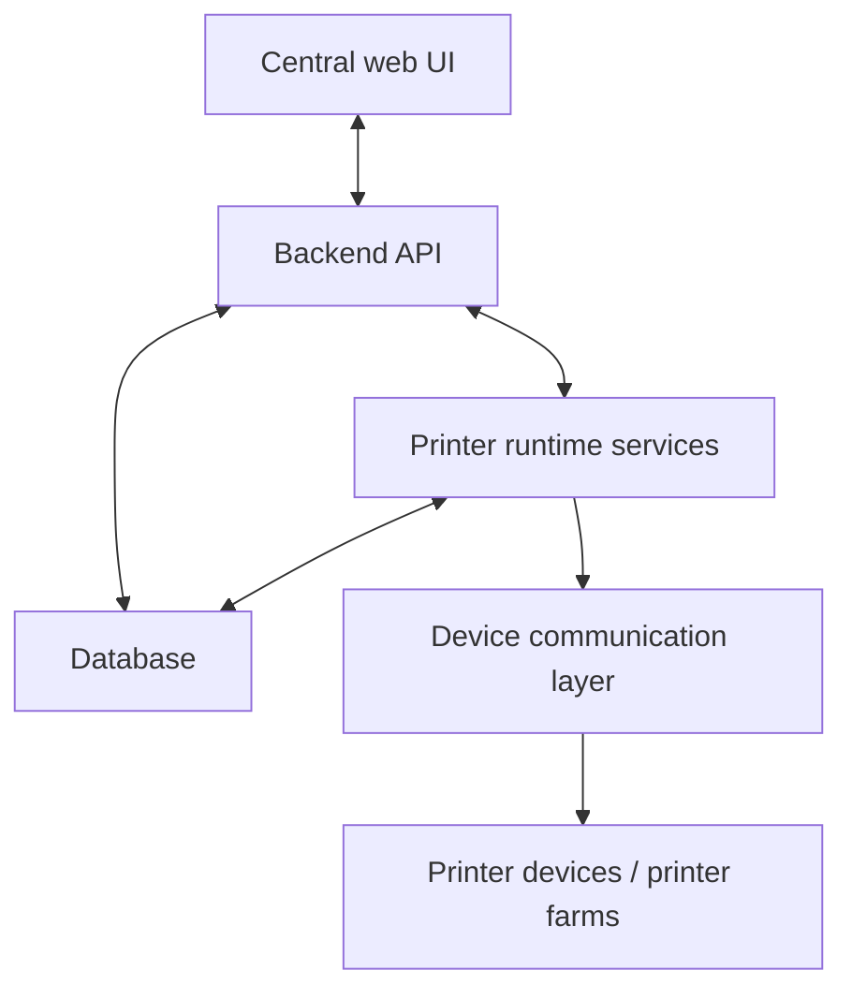

<p align="center">
  
</p>

# PrinterHub

**PrinterHub** is a Java-based system integration project for monitoring and controlling 3D printers in a structured runtime environment.

It started with direct serial communication to a real **Creality Ender-3 V2 Neo** and is evolving into a **local multi-printer runtime architecture** with background monitoring, persistence, REST API access, dashboard administration, audit visibility, asynchronous job execution, and controlled operator actions.

PrinterHub currently targets printers that speak a **Marlin-compatible G-code serial protocol**. The real-printer development reference is a **Creality Ender-3 V2 Neo**, but the runtime is intended to generalize to other Marlin-compatible printers rather than being tied to that one model.

Roadmap:

* [`docs/roadmap.md`](docs/roadmap.md)


> 
> ## NOTE : Real printer. Real serial link. Real recovery work.
> PrinterHub is currently being tested against a physical USB-connected 3D printer, with active work focused on high-speed SD upload over a constrained serial channel.
>
> Recent work adds pipelined transfer, buffered resend recovery, degraded safe replay after instability, and detailed upload diagnostics visible in the runtime.
>
> Current testing pushes aggressive batch settings on purpose, so protocol edge cases appear early and can be corrected on real hardware instead of staying hidden in simulation.
>
> The next target is an adaptive transfer controller that can recover safely, observe stability, and climb back toward a fast runtime batch size automatically. (version 0.2.4 STEP E)
---

## Current scope

Current focus:

```text
0.2.x — local runtime administration, audit visibility, dashboard UI, and job management
```

The current implementation provides:

* local multi-printer runtime
* background monitoring per configured printer
* runtime state cache
* REST API for printer administration, monitoring settings, event visibility, and controlled job execution
* SQLite persistence for printer configuration, monitoring rules, snapshots, events, jobs, and execution diagnostics
* embedded dashboard with two-level navigation
* selected-printer workspace inspired by the printer display logic
* selected-printer SD Card administration for printer-side file discovery and host-side file preparation
* controlled job-oriented actions instead of only raw direct command sending
* asynchronous job start with bounded background execution
* job history, printer history, execution events, and structured workflow-step diagnostics
* guarded host-to-printer SD-card `.gcode` upload for the verified real-printer Marlin path
* simulation modes for normal and failing printer behavior
* Jenkins CI verification and runtime smoke tests

The implementation is intentionally still focused on the **local runtime** and its operational visibility.

---

## Current runtime architecture



Operational rule:

```text
The API reads runtime state from the cache.
Background monitoring performs the polling.
Normal status and dashboard reads must not poll printers directly.
Job start requests return quickly; long-running printer workflows continue in the background.
```

Default runtime limits:

```text
API request thread pool: 8
Job executor pool:      8
Monitoring pool:        runtime-sized, with an 8-thread lazy default
```

Each printer still accepts only one active job at a time.

---

## Running locally

Build and verify:

```bash
mvn clean verify
```

Start the local runtime with an explicit database file and API port:

```bash
mvn exec:java \
  -Dprinterhub.databaseFile="printerhub-real.db" \
  -Dprinterhub.api.port=18080 \
  -Dexec.mainClass="printerhub.Main"
```

Then open:

```text
http://localhost:18080/dashboard
```

The dashboard uses relative API requests, so it follows the port used to serve the dashboard. Port `8080` is only the backend default when no `printerhub.api.port` property is provided.

Current platform note:

* the currently documented and validated runtime/release workflow is Ubuntu/Linux-oriented
* the Java runtime architecture is intended to remain cross-platform, but Windows-oriented packaging and verification are planned for a later packaging step

---

## Monitoring configuration

PrinterHub supports runtime-global monitoring rules.

Available settings:

```text
poll interval
snapshot minimum interval
temperature delta threshold
event deduplication window
error persistence behavior
```

These rules are currently global to the runtime and not yet printer-specific.

The dashboard auto-refresh is intentionally limited to live printer status fields. Full dashboard reloads happen on user action, such as the **Refresh now** button, or after create/update/delete actions that change the data model.

---

## Dashboard

PrinterHub includes an embedded dashboard as part of the local runtime.

The dashboard now uses a **two-level UI**:

### Primary navigation

```text
PrinterHub
├── Farm Home
├── Printers
├── Jobs
├── History
└── Settings
```

### Selected printer navigation

```text
Selected Printer
├── Home
├── Print
├── SD Card
├── Prepare
├── Control
├── Info
└── History
```

This structure is designed to stay aligned with the practical logic of operating a printer, while still supporting local runtime administration and diagnostics.

### Dashboard screenshots

<table>  

  <tr align="center">
    <sub>Farm Home</sub>
    
  
</tr>


  <tr align="center">
    <sub>SD card management</sub>
     
  </tr>


  <tr>
    <td align="center">
      <br>
      <sub>Settings</sub>
      
    </td>
    <td align="center">
      <br>
      <sub>Selected Printer → Print</sub>
      
    </td>
  </tr>
</table>

The dashboard is part of the local runtime architecture and reads through the API layer.

The **SD Card** view now owns:

* printer-side SD file listing
* registration of printer-side printable targets
* enable / disable of registered printable targets
* host-side `.gcode` registration and upload
* guarded copy of a host-side `.gcode` file to the selected printer SD card

The **Print** view now creates `PRINT_FILE` jobs only from already registered
printer-side file targets.

---

## Jobs and controlled actions

PrinterHub already uses the backend term **job** and keeps that terminology consistently across API, persistence, and dashboard.

At the current stage, jobs are still an early operational form and do not yet represent the full future production workflow of printing a piece from start to finish.

What is already available:

* job creation and listing
* printer assignment
* asynchronous controlled job start
* job cancellation and deletion
* job event visibility
* job execution result visibility
* structured execution-step diagnostics
* host-side `.gcode` print-file registration and dashboard upload through the SD Card workflow
* printer-side SD file discovery, registration, and enable/disable management
* guarded host-to-printer SD-card `.gcode` upload
* file-backed `PRINT_FILE` jobs created from registered printer-side SD targets
* autonomous printer-side `PRINT_FILE` activation from registered SD targets
* controlled real-printer action workflows for selected action types

Current controlled action scope:

```text
READ_TEMPERATURE
READ_POSITION
READ_FIRMWARE_INFO
HOME_AXES
SET_NOZZLE_TEMPERATURE
SET_BED_TEMPERATURE
SET_FAN_SPEED
TURN_FAN_OFF
PRINT_FILE
```

`PRINT_FILE` jobs now reference a registered printer-side SD target. PrinterHub
can register an existing host path or save a dashboard-uploaded file into the
configured print-file storage directory, then copy that host-side file to the
selected printer SD card through a guarded upload session. It can then select
that printer-side file and request an autonomous printer-side print start
through the firmware. PrinterHub validates and persists the file metadata, but
it does not slice, edit, or line-stream a full print from the host in this
version.

Current limitation:

* autonomous SD-print supervision is still early-stage: PrinterHub can start a
  printer-side file-backed print and detect completion in observable cases, but
  richer pause/cancel/progress controls remain future work

Real-printer note:

* the currently verified SD-upload path was tested against an Ender 2 Neo V3
  style Marlin behavior
* on that path, PrinterHub uses a dedicated numbered/checksummed upload session
  instead of the normal single-command request/response path
* host-to-printer SD upload is synchronous and can be very slow on this class of
  serial Marlin printer; for large real print files, it is usually more
  practical to copy the `.gcode` to the printer SD card separately and then use
  PrinterHub to refresh/register the printer-side SD target
* the dashboard upload progress shows confirmed transferred lines and transfer
  quality, but it does not make the printer-side serial transfer fast

Job start behavior:

```text
POST /jobs/{id}/start
├── validates the job and printer state
├── marks the job RUNNING
├── submits execution to the background job executor
└── returns immediately with execution outcome QUEUED
```

The dashboard and API then use job state, events, and execution steps to observe progress:

```text
GET /jobs/{id}
GET /jobs/{id}/events
GET /jobs/{id}/execution-steps
```

For autonomous SD-backed `PRINT_FILE` jobs, PrinterHub also uses monitoring to
help determine when a started printer-side file has completed on the firmware
side.

---

## Audit and diagnostics

PrinterHub already exposes and persists operational information that makes local troubleshooting easier.

Available diagnostic visibility includes:

* printer event history
* job history
* job event history
* monitoring-related runtime events
* execution command and result details
* workflow-step response, outcome, and failure detail records
* dashboard and API review of operator-triggered actions

This makes local runtime behavior easier to inspect after failures and during test or operator use.

---

## Printer state machine

Each monitored printer node follows the same runtime state model.



Defined states:

```text
DISCONNECTED
CONNECTING
IDLE
HEATING
PRINTING
ERROR
UNKNOWN
```

---

## Industrial context

PrinterHub is not just a single-printer control exercise.

It models the transition from:

```text
single USB-connected printer
```

toward:

```text
structured multi-printer runtime monitoring and administration
```

and later:

```text
centralized multi-site printer management
```

Related background:

* [`docs/industrial-bio-printer-simulation.md`](docs/industrial-bio-printer-simulation.md)

---

## Target architecture direction

The longer-term direction goes beyond a local runtime and moves toward centralized orchestration.



---

## DevOps and verification

PrinterHub uses Jenkins-based CI.

The current pipeline verifies:

* Maven build and test execution
* runtime and API smoke lifecycle
* robustness scenarios with mixed healthy and failing printers
* JaCoCo coverage reporting
* release bundle preparation

Details:

* [`docs/devops.md`](docs/devops.md)

Useful local verification commands:

```bash
mvn test
mvn clean verify
mvn -Dtest=AsyncPrintJobExecutorTest,PrintJobExecutionServiceTest test
mvn -Dtest=RemoteApiServerTest test
```

---

## Repository structure

```text
printer-hub/
├── README.md
├── Jenkinsfile
├── docs/
│   ├── roadmap.md
│   ├── quickstart.md
│   ├── install.md
│   ├── developer.md
│   ├── devops.md
│   ├── version.md
│   └── ...
├── src/
│   ├── main/
│   │   ├── java/printerhub/
│   │   │   ├── api/
│   │   │   ├── command/
│   │   │   ├── config/
│   │   │   ├── job/
│   │   │   ├── monitoring/
│   │   │   ├── persistence/
│   │   │   ├── runtime/
│   │   │   ├── serial/
│   │   │   └── ...
│   │   └── resources/
│   │       └── dashboard/
│   │           ├── components/
│   │           ├── views/
│   │           └── ...
│   └── test/
│       └── java/printerhub/
│           └── ...
└── pom.xml
```

---

## Documentation

* Setup and prerequisites: [`docs/install.md`](docs/install.md)
* Local usage: [`docs/quickstart.md`](docs/quickstart.md)
* Developer reference: [`docs/developer.md`](docs/developer.md)
* CI and release workflow: [`docs/devops.md`](docs/devops.md)
* Planned evolution: [`docs/roadmap.md`](docs/roadmap.md)

---

## License

MIT License

* [`LICENSE`](LICENSE)
 
