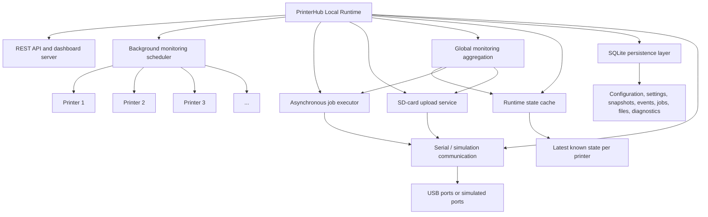
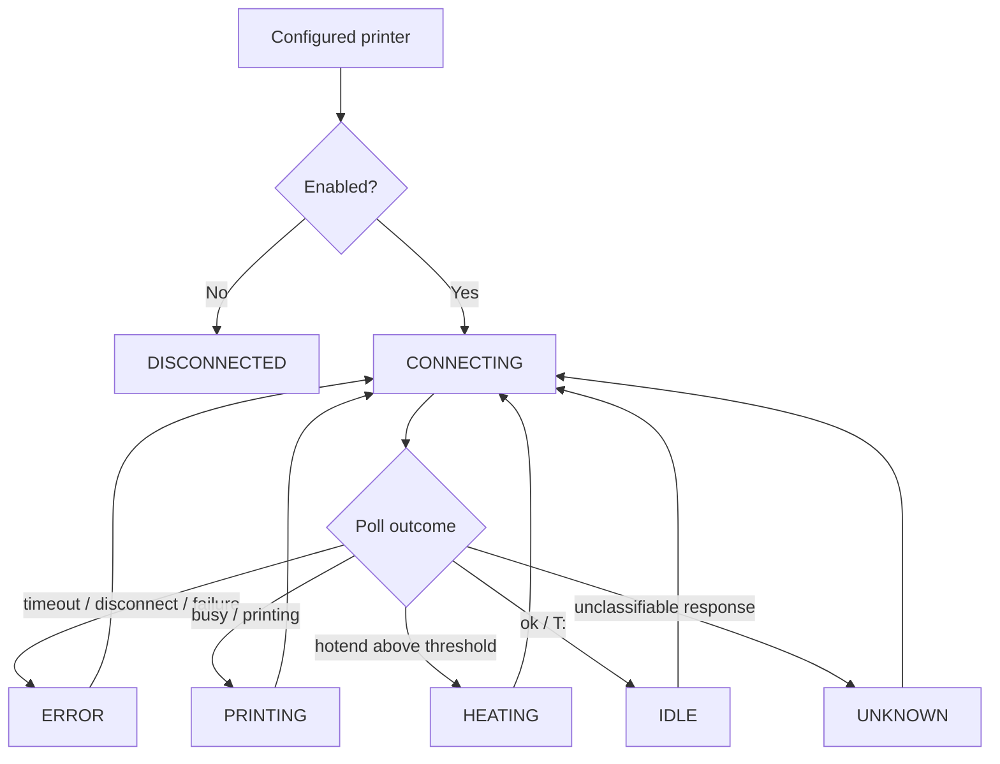
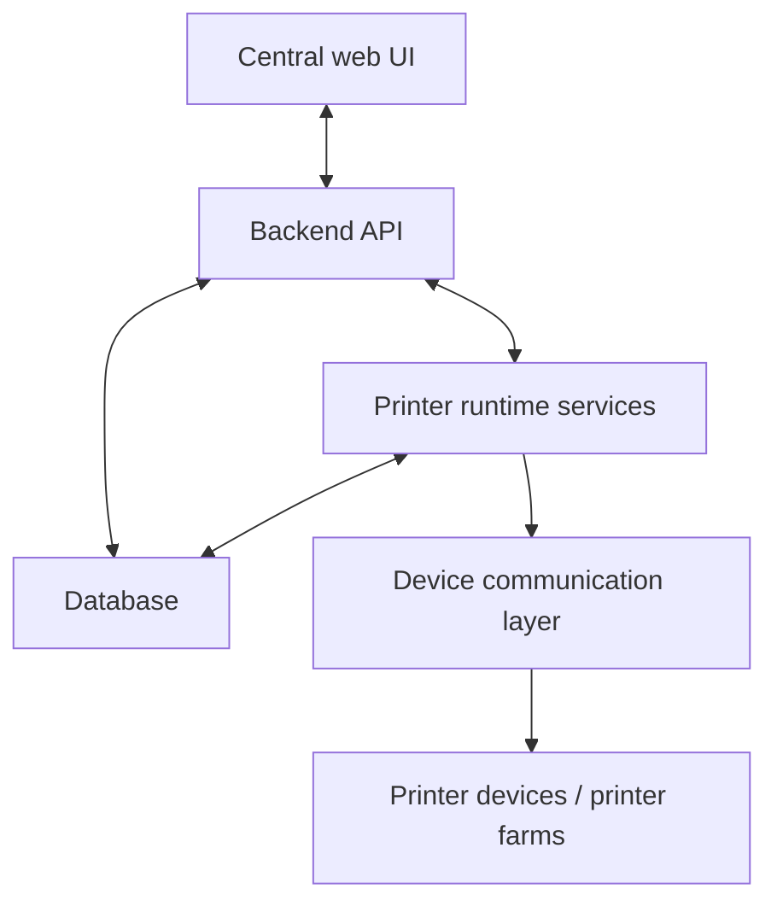

<p align="center">
  
</p>

# PrinterHub

**PrinterHub** is a Java-based system integration project for monitoring and controlling 3D printers in a structured local runtime environment.

It started with direct serial communication to a real **Creality Ender-3 V2 Neo** and is evolving into a **local multi-printer runtime architecture** with background monitoring, persistence, REST API access, dashboard administration, audit visibility, asynchronous job execution, controlled operator actions, SD-card upload monitoring, and cross-printer runtime observability.

PrinterHub currently targets printers that speak a **Marlin-compatible G-code serial protocol**. The real-printer development reference remains the Creality Ender-series Marlin behavior used during USB serial and SD-card upload verification.

Roadmap:

* [`docs/roadmap.md`](docs/roadmap.md)

---

## Current scope

PrinterHub is currently focused on the **local runtime**: one running PrinterHub instance controls and observes one local printer farm through USB-connected or simulated printers.

Current focus:

```text
0.2.x — local runtime administration, audit visibility, dashboard UI, job management, SD-card upload observability, and global runtime monitoring
```

The current implementation provides:

* local multi-printer runtime
* background monitoring per configured printer
* runtime state cache
* REST API for printer administration, monitoring settings, runtime monitoring, event visibility, controlled job execution, SD-card upload, and diagnostics
* SQLite persistence for printer configuration, monitoring rules, serial transfer settings, snapshots, events, jobs, files, and execution diagnostics
* embedded dashboard with global and selected-printer workspaces
* global Monitoring workspace for cross-printer runtime visibility
* selected-printer workspace inspired by practical printer operation
* selected-printer SD Card administration for printer-side file discovery and host-side file preparation
* guarded host-to-printer SD-card `.gcode` upload for the verified Marlin serial path
* live upload telemetry, adaptive transfer diagnostics, and remote dashboard synchronization
* controlled job-oriented actions instead of only raw direct command sending
* asynchronous job start with bounded background execution
* job history, printer history, execution events, and structured workflow-step diagnostics
* simulation modes for normal and failing printer behavior
* Jenkins CI verification and runtime smoke tests
* remote Windows bootstrap and versioned update via OpenSSH and PowerShell helper scripts

PrinterHub is intentionally not yet a centralized SaaS or multi-site production control platform. The current system is a local runtime with operational visibility and controlled administration.

---

## Real-printer and serial-upload note

PrinterHub is tested against physical USB-connected Marlin-style 3D printers. A major part of the current work is reliable host-to-printer SD-card upload over a constrained serial channel.

The SD-upload path includes:

* numbered and checksummed G-code upload session
* pipelined transfer
* buffered resend recovery
* adaptive batch-size behavior
* degraded safe replay after instability
* transfer quality metrics
* live upload progress
* adaptive transfer diagnostics in the dashboard
* synchronization support for observing an upload from another browser or PC

This is real serial recovery work, not only simulation. Simulation remains important for automated tests, but the implementation is shaped by real printer behavior.

---

## Current runtime architecture



Operational rule:

```text
The API reads runtime state from the cache or runtime services.
Background monitoring performs normal polling.
Normal status and dashboard reads must not poll printers directly.
Job start requests return quickly; long-running printer workflows continue in the background.
```

Default runtime limits:

```text
API request thread pool: 8
Job executor pool:      8
Monitoring pool:        runtime-sized, with an 8-thread lazy default
```

Each printer accepts only one active controlled job or guarded action at a time.

---

## Running locally

Build and verify:

```bash
mvn clean verify
```

Start the local runtime with an explicit database file and API port:

```bash
mvn exec:java \
  -Dprinterhub.databaseFile="printerhub.db" \
  -Dprinterhub.api.port=18080 \
  -Dexec.mainClass="printerhub.Main"
```

Then open:

```text
http://localhost:18080/dashboard
```

The dashboard uses relative API requests, so it follows the port used to serve the dashboard. Port `8080` is only the backend default when no `printerhub.api.port` property is provided.

---

## Monitoring and runtime settings

PrinterHub supports runtime-global monitoring rules and serial transfer settings.

Monitoring settings include:

```text
poll interval
snapshot minimum interval
temperature delta threshold
event deduplication window
error persistence behavior
debug wire tracing
```

Serial transfer settings include upload and file-streaming parameters used by the SD-card upload path, including batch-size limits, recovery thresholds, retry limits, and read timing values.

These settings are currently global to the runtime and not yet printer-specific.

The dashboard auto-refresh is intentionally selective. Lightweight live fields can refresh automatically, while heavier actions such as SD-card file listing remain explicit user actions.

---

## Dashboard

PrinterHub includes an embedded dashboard as part of the local runtime.

The dashboard uses global navigation plus a selected-printer workspace.

### Primary navigation

```text
PrinterHub
├── Farm Home
├── Printers
├── Jobs
├── Monitoring
├── History
└── Settings
```

### Selected printer navigation

```text
Selected Printer
├── Home
├── Print
├── SD Card
├── Prepare
├── Control
├── Info
└── History
```

The structure separates fleet-level administration from selected-printer operation.

### Global Monitoring workspace

The **Monitoring** page provides cross-printer runtime visibility.

It shows:

* fleet runtime summary
* printer runtime states
* active and recent jobs
* active or last-known SD uploads
* upload health
* adaptive transfer diagnostics
* follow actions for jobs and uploads

From Monitoring, an operator can follow an active upload or job and jump into the relevant selected-printer workspace.

### Selected-printer SD Card workspace

The **SD Card** view owns:

* printer-side SD file listing
* registration of printer-side printable targets
* enable / disable of registered printable targets
* host-side `.gcode` registration and upload
* guarded copy of a host-side `.gcode` file to the selected printer SD card
* upload progress
* upload quality
* transfer performance
* adaptive transfer diagnostics
* manual or synchronized upload-status refresh

### Selected-printer Print workspace

The **Print** view creates `PRINT_FILE` jobs from already registered printer-side file targets.

The dashboard is part of the local runtime architecture and reads through the API layer.

---

## Dashboard screenshots

<table>
  <tr>
    <td align="center">
      <sub>Farm Home</sub><br>
      
    </td>
  </tr>
  <tr>
    <td align="center">
      <sub>Selected Printer → Print</sub><br>
      
    </td>
  </tr>
  <tr>
    <td align="center">
      <sub>SD card management</sub><br>
      
    </td>
  </tr>
</table>

---

## Jobs and controlled actions

PrinterHub uses the backend term **job** consistently across API, persistence, and dashboard.

At the current stage, jobs are operational control records. They are not yet the full future production workflow of slicing, queueing, printing, supervising, and completing a manufactured part.

What is already available:

* job creation and listing
* printer assignment
* asynchronous controlled job start
* job cancellation and deletion
* job event visibility
* job execution result visibility
* structured execution-step diagnostics
* host-side `.gcode` print-file registration
* dashboard upload of host-side `.gcode` files
* printer-side SD file discovery, registration, and enable/disable management
* guarded host-to-printer SD-card `.gcode` upload
* file-backed `PRINT_FILE` jobs created from registered printer-side SD targets
* autonomous printer-side `PRINT_FILE` activation from registered SD targets
* controlled real-printer action workflows for selected action types

Current controlled action scope:

```text
READ_TEMPERATURE
READ_POSITION
READ_FIRMWARE_INFO
HOME_AXES
SET_NOZZLE_TEMPERATURE
SET_BED_TEMPERATURE
SET_FAN_SPEED
TURN_FAN_OFF
PRINT_FILE
```

`PRINT_FILE` jobs reference a registered printer-side SD target. PrinterHub can register an existing host path or save a dashboard-uploaded file into the configured print-file storage directory, copy that host-side file to the selected printer SD card through a guarded upload session, and then request a firmware-side print start.

PrinterHub validates and persists file metadata, but it does not slice, edit, or line-stream a full print from the host in this version.

Current limitation:

* autonomous SD-print supervision is still early-stage
* PrinterHub can start a printer-side file-backed print and detect completion in observable cases
* richer pause, cancel, and print-progress controls remain future work

Job start behavior:

```text
POST /jobs/{id}/start
├── validates the job and printer state
├── marks the job RUNNING
├── submits execution to the background job executor
└── returns immediately with execution outcome QUEUED
```

The dashboard and API then use job state, events, and execution steps to observe progress:

```text
GET /jobs/{id}
GET /jobs/{id}/events
GET /jobs/{id}/execution-steps
```

For autonomous SD-backed `PRINT_FILE` jobs, PrinterHub also uses monitoring to help determine when a started printer-side file has completed on the firmware side.

---

## SD-card upload observability

Host-to-printer SD-card upload is one of the main real-printer verification paths.

PrinterHub exposes upload visibility through:

```text
POST /printers/{id}/sd-card/uploads
GET  /printers/{id}/sd-card/uploads/status
```

The dashboard displays:

* upload state
* file name
* confirmed lines / total lines
* confirmed bytes / total bytes
* elapsed time
* estimated remaining time
* bytes per second
* lines per second
* rejected/resend count
* transfer quality
* current transfer mode
* configured and active batch sizes
* stability and recovery pressure
* last adaptation reason

The upload monitor is split into operator-facing progress and deeper adaptive diagnostics, so the user can either simply check that the upload works or inspect controller behavior during long transfers.

---

## Audit and diagnostics

PrinterHub exposes and persists operational information that makes local troubleshooting easier.

Available diagnostic visibility includes:

* printer event history
* job history
* job event history
* monitoring-related runtime events
* upload recovery and adaptation events
* execution command and result details
* workflow-step response, outcome, and failure detail records
* dashboard and API review of operator-triggered actions

This makes local runtime behavior easier to inspect after failures and during hardware tests.

---

## Printer state machine

Each monitored printer node follows the same runtime state model.



Defined states:

```text
DISCONNECTED
CONNECTING
IDLE
HEATING
PRINTING
ERROR
UNKNOWN
```

---

## Industrial context

PrinterHub is not just a single-printer control exercise.

It models the transition from:

```text
single USB-connected printer
```

toward:

```text
structured multi-printer runtime monitoring and administration
```

and later:

```text
centralized multi-site printer management
```

Related background:

* [`docs/industrial-bio-printer-simulation.md`](docs/industrial-bio-printer-simulation.md)

---

## Target architecture direction

The longer-term direction goes beyond a local runtime and moves toward centralized orchestration.



---

## DevOps and verification

PrinterHub uses Jenkins-based CI.

The current pipeline verifies:

* Maven build and test execution
* runtime and API smoke lifecycle
* robustness scenarios with mixed healthy and failing printers
* JaCoCo coverage reporting
* release bundle preparation

Details:

* [`docs/devops.md`](docs/devops.md)

Useful local verification commands:

```bash
mvn test
mvn clean verify
mvn -Dtest=RemoteApiServerTest test
mvn -Dtest=SdCardUploadServiceTest test
mvn -Dtest=AsyncPrintJobExecutorTest,PrintJobExecutionServiceTest test
```

---

## Repository structure

```text
printer-hub/
├── README.md
├── Jenkinsfile
├── docs/
│   ├── roadmap.md
│   ├── quickstart.md
│   ├── install.md
│   ├── developer.md
│   ├── devops.md
│   ├── version.md
│   └── ...
├── src/
│   ├── main/
│   │   ├── java/printerhub/
│   │   │   ├── api/
│   │   │   ├── command/
│   │   │   ├── config/
│   │   │   ├── job/
│   │   │   ├── monitoring/
│   │   │   ├── persistence/
│   │   │   ├── runtime/
│   │   │   ├── serial/
│   │   │   └── ...
│   │   └── resources/
│   │       └── dashboard/
│   │           ├── components/
│   │           ├── views/
│   │           └── ...
│   └── test/
│       └── java/printerhub/
│           └── ...
├── ops/
├── tools/
│   └── win/
└── pom.xml
```

---

## Documentation

* Setup and prerequisites: [`docs/install.md`](docs/install.md)
* Local usage: [`docs/quickstart.md`](docs/quickstart.md)
* Developer reference: [`docs/developer.md`](docs/developer.md)
* CI and release workflow: [`docs/devops.md`](docs/devops.md)
* Planned evolution: [`docs/roadmap.md`](docs/roadmap.md)

---

## License

MIT License

* [`LICENSE`](LICENSE)
 
