<p align="center">
  
</p>

# SpaghettiChef

**SpaghettiChef** is a Java-based local runtime for monitoring and controlling 3D printers through an embedded dashboard, REST API, persistent runtime state, controlled printer workflows, and camera-based visual analysis.

SpaghettiChef is local-first. One runtime supervises one local printer farm through USB-connected or simulated printers. The current hardware reference is a Marlin-compatible Creality Ender-series printer, while simulation support keeps the runtime testable without physical hardware.

The project currently combines:

* local multi-printer runtime management
* embedded browser dashboard
* REST API
* SQLite-backed runtime state
* background printer monitoring
* controlled print-job and printer-action workflows
* host-to-printer SD-card upload diagnostics
* local role/security and operator audit records
* camera capture and persisted image analysis
* experimental Rust-based image analysis tooling

For the detailed version plan, see [`docs/roadmap.md`](docs/roadmap.md).

---

## What SpaghettiChef does

SpaghettiChef provides a structured local control layer around 3D printers.

At the current stage, it can:

* register and monitor multiple printers
* work with simulated and USB-connected printers
* expose printer state through a REST API
* serve an embedded dashboard from the same runtime
* create and start controlled print jobs
* upload `.gcode` files to printer-side SD storage
* track upload progress and recovery behavior
* persist printer events, job events, camera events, and audit history
* configure camera capture per printer
* capture live snapshots
* retain source snapshots under camera jobs
* generate persisted delta frames
* run persisted calculation workflows
* review camera analysis sessions
* run a standalone Rust CLI image analyzer experiment

SpaghettiChef does not currently try to replace a slicer or a full production MES. It focuses on the local runtime layer: printer communication, control, observation, persistence, and operator-facing diagnostics.

---

## Current development focus

The current technical focus is the camera and visual-analysis subsystem.

The 0.4.x work established a persisted camera model:

```text
Camera Job
    ↓
Source Snapshots
    ↓
Delta Sets
    ↓
Calculation Runs
    ↓
Analysis Session Review
```

The 0.5.x work introduces an independent Rust image-analysis track. The Rust tool is developed first as a standalone CLI analyzer and is intentionally not coupled to the Java backend at the beginning.

---

## System overview

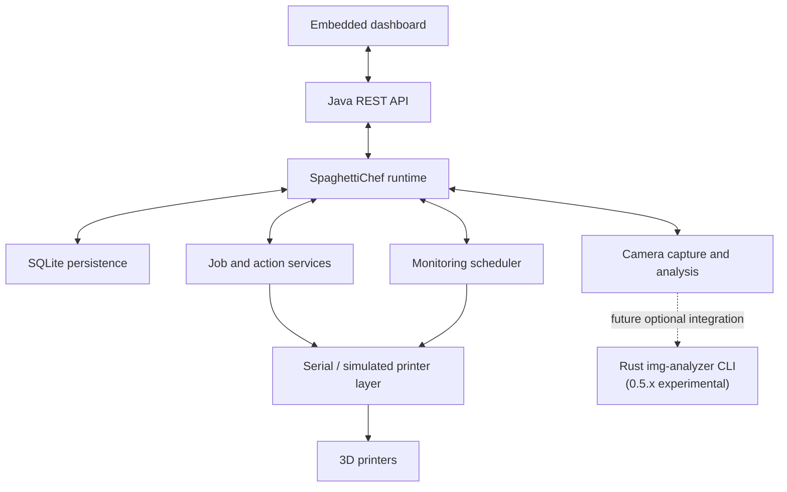

SpaghettiChef keeps the Java runtime as the owner of API, persistence, dashboard, scheduling, printer workflows, and camera-job state. External image analyzers are treated as optional calculation engines, not as replacement backends.

---

## Dashboard

SpaghettiChef includes an embedded dashboard served by the local runtime.

The dashboard separates global runtime administration from selected-printer operation.

### Primary navigation

```text
SpaghettiChef
├── Farm Home
├── Printers
├── Jobs
├── Monitoring
├── History
└── Settings
```

### Selected-printer navigation

```text
Selected Printer
├── Home
├── Print
├── SD Card
├── Prepare
├── Control
├── Info
├── History
└── Camera / Analysis
```

### Admin and analysis areas

The camera and admin views expose persisted camera data:

```text
Admin / Camera Data
├── camera jobs
├── retained source snapshots
├── delta sets
├── calculation runs
└── recalculation workflows
```

The dashboard uses the API layer. It does not talk directly to serial devices or filesystem internals.

---

## Dashboard screenshots

The screenshots below provide a visual overview of the current runtime, dashboard, camera analysis, and Rust analyzer work.

<table>
  <tr>
    <td align="center">
      <sub>Farm Home</sub><br>
      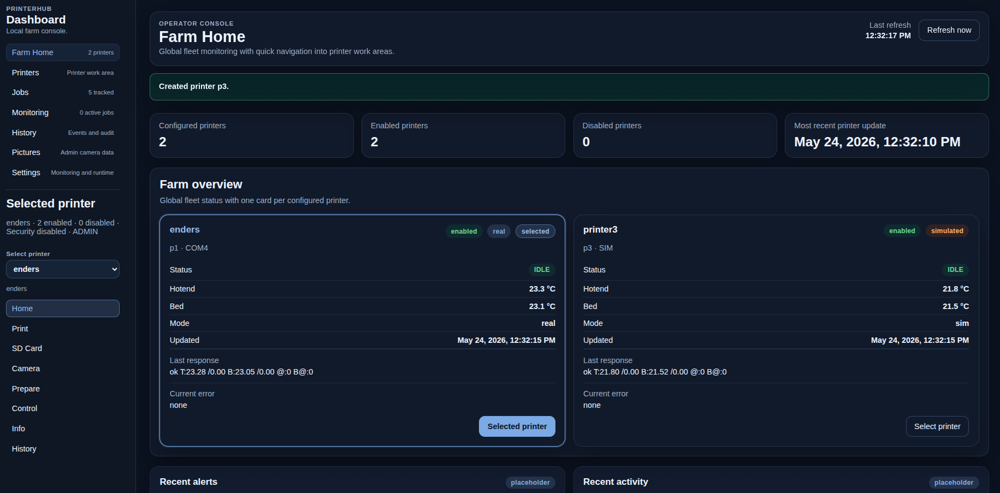
    </td>
  </tr>
  <tr>
    <td align="center">
      <sub>Selected Printer → Home</sub><br>
      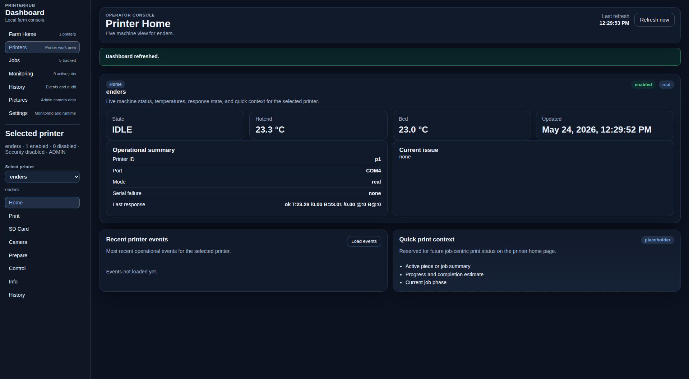
    </td>
  </tr>
  <tr>
    <td align="center">
      <sub>Selected Printer → Print</sub><br>
      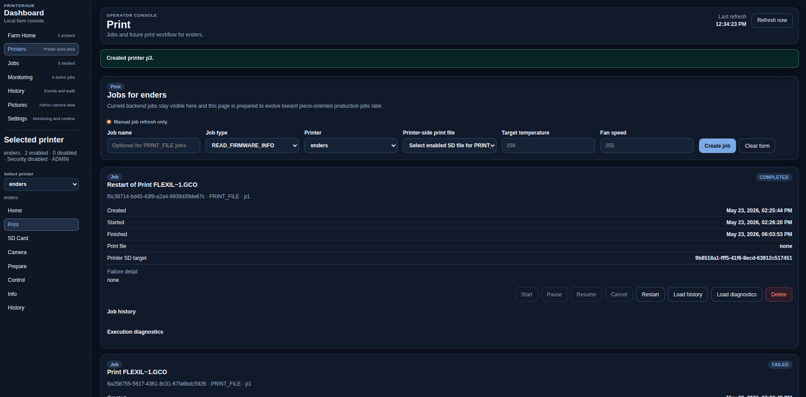
    </td>
  </tr>
  <tr>
    <td align="center">
      <sub>SD Card Management</sub><br>
      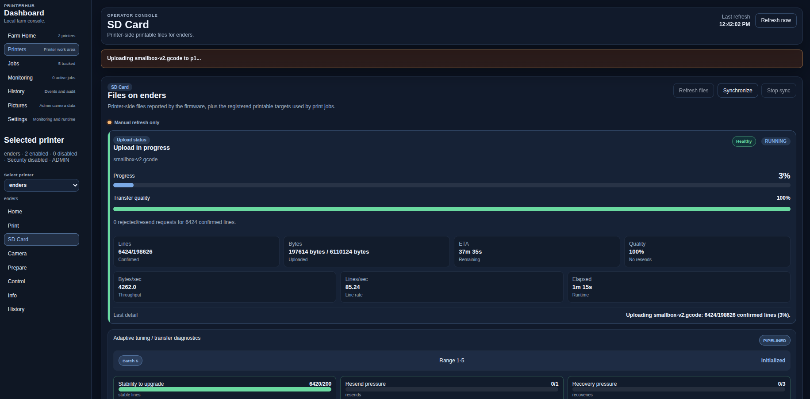
    </td>
  </tr>
  <tr>
    <td align="center">
      <sub>Camera Analysis</sub><br>
      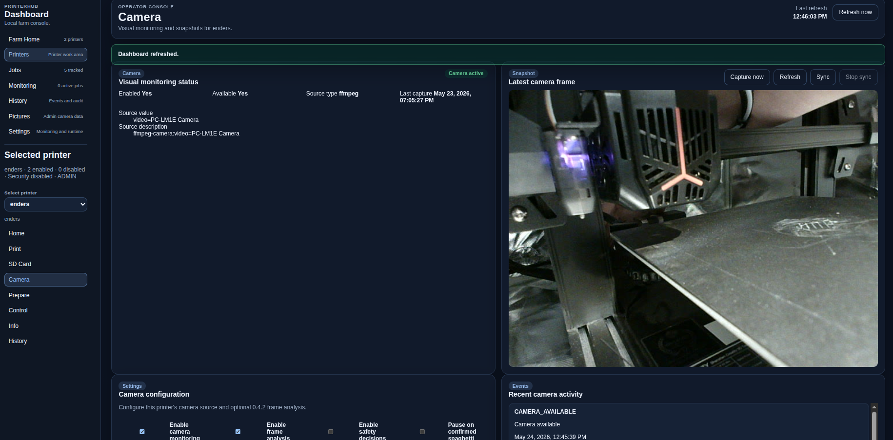
    </td>
  </tr>
  <tr>
    <td align="center">
      <sub>Admin Camera Data</sub><br>
      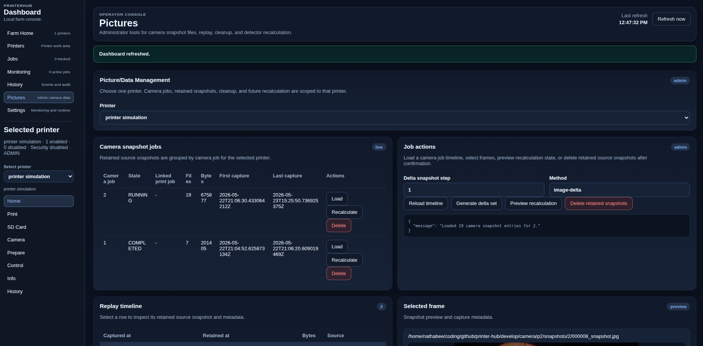
    </td>
  </tr>
  <tr>
    <td align="center">
      <sub>Analysis Review</sub><br>
      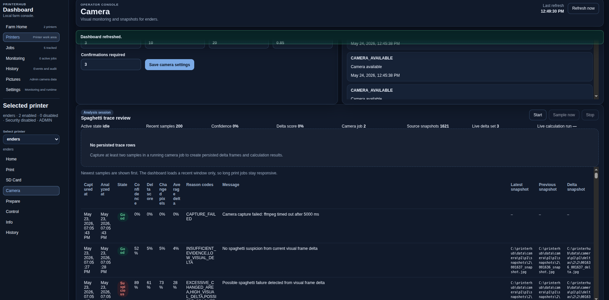
    </td>
  </tr>
  <tr>
    <td align="center">
      <sub>Rust img-analyzer terminal output</sub><br>
      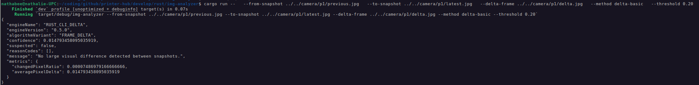
    </td>
  </tr>
</table>
 

---

## Camera monitoring and visual analysis

SpaghettiChef includes a camera pipeline for per-printer image capture and persisted analysis.

The current camera model distinguishes live preview files from persisted analysis data.

```text
Live preview files
├── latest.jpg
├── previous.jpg
└── delta.jpg

Persisted analysis data
├── camera jobs
├── source snapshots
├── delta sets
├── delta frames
├── calculation runs
└── calculation results
```

Live files are volatile working files. Persisted review and recalculation use database-owned source snapshots, delta frames, and calculation results.

### Camera analysis pipeline

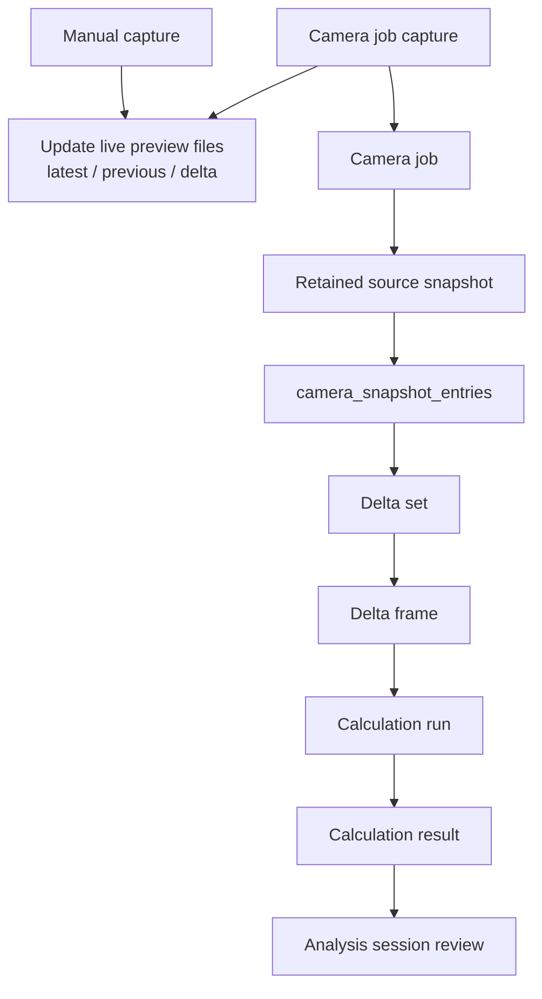

### Camera job ownership

A camera job owns retained source snapshots for one camera run.

```text
data/camera/<printerId>/
├── latest.jpg
├── previous.jpg
├── delta.jpg
├── snapshots/
│   └── <cameraJobId>/
│       ├── <snapshotEntryId>_snapshot.jpg
│       └── ...
└── deltas/
    └── <cameraJobId>/
        └── <deltaSetId>/
            ├── <from>_<to>_delta.jpg
            └── ...
```

A camera job may be linked to a print job, but it is not a print job. Camera jobs do not execute printer commands, movement, upload, pause, cancel, or print-start actions.

### Delta sets and calculation runs

A delta set is generated from the source snapshots of one camera job.

A calculation run is generated from one selected delta set.

This separation allows multiple analysis attempts over the same camera data:

```text
Camera Job 12
├── Delta Set 1
│   ├── Calculation Run 1
│   └── Calculation Run 2
└── Delta Set 2
    └── Calculation Run 3
```

That makes recalculation and future engine comparison possible without overwriting previous analysis results.

---

## Rust image-analysis track

The 0.5.x track adds an experimental Rust image-analysis component.

The first Rust step is intentionally standalone:

```text
SpaghettiChef camera files
        ↓
rust/img-analyzer
        ↓
JSON result on stdout
```

The Rust analyzer currently lives under:

```text
rust/img-analyzer/
```

It can be built and run independently from the Java backend.

Example:

```bash
cd rust/img-analyzer

cargo run -- \
  --from-snapshot ../../camera/p1/previous.jpg \
  --to-snapshot ../../camera/p1/latest.jpg \
  --method delta-basic \
  --threshold 0.20
```

Example output:

```json
{
  "engineName": "RUST_CLI_DELTA",
  "engineVersion": "0.5.0",
  "algorithmVariant": "FRAME_DELTA",
  "confidence": 0.0148,
  "suspected": false,
  "reasonCodes": [],
  "message": "No large visual difference detected between snapshots.",
  "metrics": {
    "changedPixelRatio": 0.00007,
    "averagePixelDelta": 0.0148
  }
}
```

The Rust tool is not a second REST backend. The planned direction is a selectable calculation-engine model where Java remains the runtime owner and Rust can later be called as an optional external analyzer.

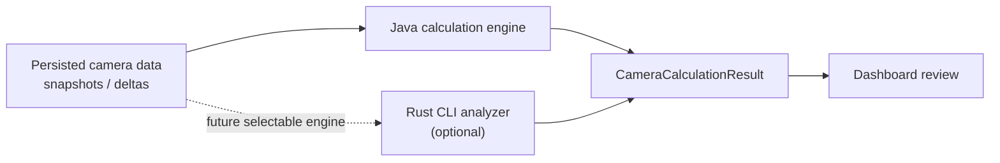

---

## Printer runtime and monitoring

SpaghettiChef monitors each configured printer node through the runtime scheduler.

The runtime state model is shared by simulated and USB-connected printers.

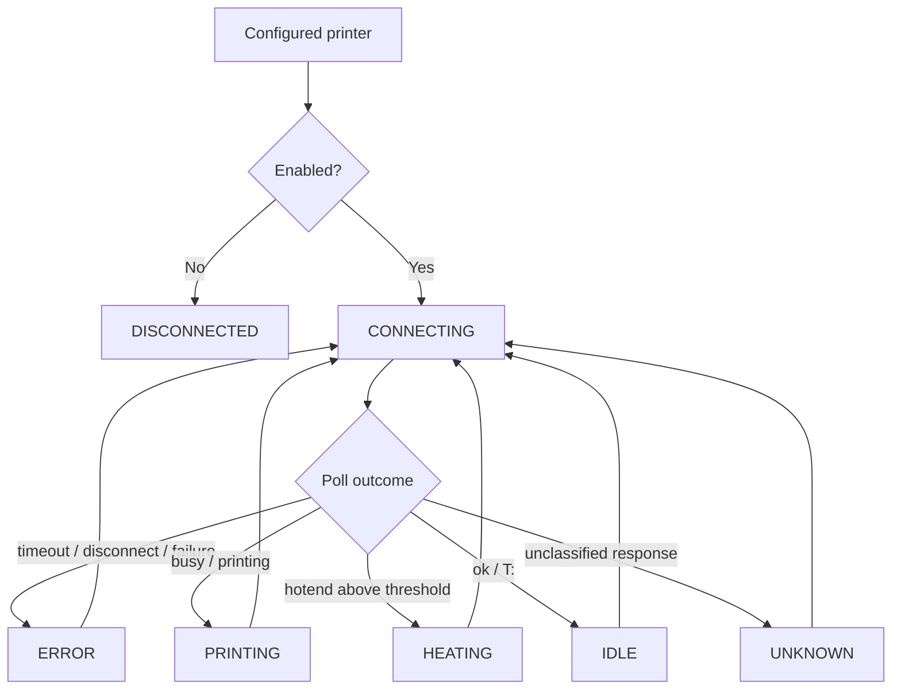

Defined states:

```text
DISCONNECTED
CONNECTING
IDLE
HEATING
PRINTING
ERROR
UNKNOWN
```

Monitoring data is persisted as runtime state and event history, so the dashboard can show current state and recent operational events.

---

## Jobs and controlled actions

SpaghettiChef uses backend jobs for controlled runtime operations.

Current job and action capabilities include:

* job creation and listing
* printer assignment
* asynchronous controlled job start
* job cancellation and deletion
* job event visibility
* execution-step diagnostics
* registered printer-side SD targets
* file-backed `PRINT_FILE` jobs
* guarded printer action workflows

Controlled action scope includes:

```text
READ_TEMPERATURE
READ_POSITION
READ_FIRMWARE_INFO
HOME_AXES
SET_NOZZLE_TEMPERATURE
SET_BED_TEMPERATURE
SET_FAN_SPEED
TURN_FAN_OFF
PRINT_FILE
```

A `PRINT_FILE` job references a registered printer-side SD target. SpaghettiChef can register a host-side `.gcode` file, upload it to printer-side SD storage through a guarded transfer session, and request a firmware-side print start.

SpaghettiChef does not currently slice models, edit G-code, or line-stream a full print from the host as its main workflow.

---

## SD-card upload observability

Host-to-printer SD-card upload is one of the main real-printer verification paths.

SpaghettiChef exposes upload visibility through the API and dashboard.

Upload diagnostics include:

* upload state
* file name
* confirmed lines / total lines
* confirmed bytes / total bytes
* elapsed time
* estimated remaining time
* bytes per second
* lines per second
* rejected/resend count
* transfer quality
* current transfer mode
* configured and active batch sizes
* stability and recovery pressure
* last adaptation reason

This makes long serial transfers observable instead of opaque.

---

## Security, confirmation, and audit

SpaghettiChef includes a local role model for runtime operations.

Roles include:

```text
VIEWER
OPERATOR
ADMIN
```

Dangerous or state-changing actions can require confirmation, including heating, movement, print start/cancel, SD delete, upload overwrite, and raw command paths.

SpaghettiChef persists operator audit records for accepted and rejected state-changing actions.

---

## Local storage model

SpaghettiChef keeps runtime state in SQLite and filesystem-backed working directories.

Typical local development data includes:

```text
spaghettichef.db
data/
camera/
spaghettichef-print-files/
```

Development runtime data and generated camera files are ignored by Git.

---

## Running locally

Build and verify:

```bash
mvn clean verify
```

Start the local runtime with an explicit database file and API port:

```bash
mvn exec:java \
  -Dspaghettichef.databaseFile="spaghettichef.db" \
  -Dspaghettichef.api.port=18080 \
  -Dexec.mainClass="spaghettichef.Main"
```

Open the dashboard:

```text
http://localhost:18080/dashboard
```

The dashboard uses relative API requests, so it follows the port used by the embedded server.

---

## Running the Rust analyzer

The Rust analyzer is currently independent from the Java runtime.

Build and test:

```bash
cd rust/img-analyzer

cargo fmt
cargo test
cargo build
```

Run against two image files:

```bash
cargo run -- \
  --from-snapshot ../../camera/p1/previous.jpg \
  --to-snapshot ../../camera/p1/latest.jpg \
  --method delta-basic \
  --threshold 0.20
```

For details, see:

* [`rust/img-analyzer/README.md`](rust/img-analyzer/README.md)

---

## API examples

Common local endpoints:

```text
GET  /health
GET  /printers
GET  /printers/{id}
GET  /printers/{id}/status
POST /printers
PUT  /printers/{id}
POST /jobs
POST /jobs/{id}/start
GET  /jobs
GET  /jobs/{id}/events
GET  /settings/monitoring
PUT  /settings/monitoring
```

Camera endpoints include diagnostic live snapshot access and admin camera-data workflows:
 
```text
POST /printers/{printerId}/camera/snapshot
GET  /printers/{printerId}/camera/snapshot
POST /printers/{printerId}/camera/jobs/start
POST /printers/{printerId}/camera/jobs/stop
GET  /printers/{printerId}/camera/jobs/active

GET  /admin/camera/snapshot/jobs?printerId=<printerId>
GET  /admin/camera/snapshot/jobs/{cameraJobId}/timeline?printerId=<printerId>
GET  /admin/camera/snapshot/files/{snapshotEntryId}
```

For the full API surface, see [`docs/rest-api.md`](docs/rest-api.md).

---

## Repository structure

```text
spaghetti-chef/
├── README.md
├── Jenkinsfile
├── docs/
│   ├── roadmap.md
│   ├── camera.md
│   ├── dashboard.md
│   ├── quickstart.md
│   ├── install.md
│   ├── developer.md
│   ├── devops.md
│   └── TODOs/
├── src/
│   ├── main/
│   │   ├── java/spaghettichef/
│   │   │   ├── api/
│   │   │   ├── camera/
│   │   │   ├── command/
│   │   │   ├── config/
│   │   │   ├── job/
│   │   │   ├── monitoring/
│   │   │   ├── persistence/
│   │   │   ├── runtime/
│   │   │   ├── security/
│   │   │   ├── serial/
│   │   │   └── ...
│   │   └── resources/
│   │       └── dashboard/
│   │           ├── components/
│   │           ├── views/
│   │           └── ...
│   └── test/
│       └── java/spaghettichef/
├── rust/
│   └── img-analyzer/
├── ops/
├── tools/
├── pom.xml
└── LICENSE
```

---

## Roadmap

The detailed roadmap is maintained in:

* [`docs/roadmap.md`](docs/roadmap.md)

Current direction:

```text
0.4.x  Camera jobs, persisted snapshots, delta sets, calculation runs, analysis review
0.5.x  Rust image analyzer and future configurable calculation engines
0.6.x  Replay, compression, and simulation review
1.0.x  Central multi-farm architecture
```

---

## Documentation

* [`docs/roadmap.md`](docs/roadmap.md) — version roadmap
* [`docs/camera.md`](docs/camera.md) — camera subsystem
* [`docs/dashboard.md`](docs/dashboard.md) — dashboard structure
* [`docs/rest-api.md`](docs/rest-api.md) — API reference
* [`docs/quickstart.md`](docs/quickstart.md) — local usage
* [`docs/install.md`](docs/install.md) — installation notes
* [`docs/developer.md`](docs/developer.md) — developer reference
* [`docs/devops.md`](docs/devops.md) — CI and release workflow

---

## DevOps and verification

SpaghettiChef uses Jenkins-based CI.

The current pipeline verifies:

* Maven build and test execution
* runtime and API smoke lifecycle
* robustness scenarios with mixed healthy and failing printers
* JaCoCo coverage reporting
* release bundle preparation

Useful local verification commands:

```bash
mvn test
mvn clean verify
mvn -Dtest=RemoteApiServerTest test
mvn -Dtest=SdCardUploadServiceTest test
mvn -Dtest=AsyncPrintJobExecutorTest,PrintJobExecutionServiceTest test
```

Rust analyzer verification:

```bash
cd rust/img-analyzer
cargo fmt
cargo test
cargo build
```


---

## License

MIT License

See [`LICENSE`](LICENSE).