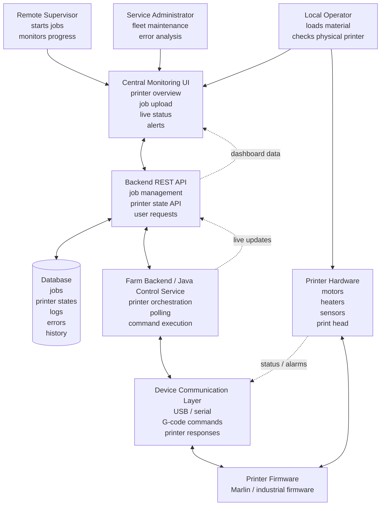

> **Project restructuring notice**
>
> SpaghettiChef is currently being developped
>
> Some details in this document still describe the previous prototype state. The documentation will be cleaned up after the runtime architecture stabilizes.
>
> Current source of truth: [`docs/roadmap.md`](roadmap.md)

# Industrial Bio-Printer Environment Simulation

## Using an Ender-3 Printer as System Integration Prototype

This project simulates an industrial printer farm environment inspired by bio-printer infrastructures used in hospitals, laboratories, and medical production settings.

The goal is not firmware development or mechanical design. The focus is system-level software: printer communication, monitoring, job control, REST APIs, database persistence, and centralized fleet supervision.

An Ender-3 printer is used as the physical prototype because it follows the same basic architecture as an industrial printer: control software sends commands, firmware executes them, sensors report status, and the system must react to errors.

---

## 1. Why Bio-Printers Matter

Bio-printers are used to fabricate biological structures such as artificial skin, cartilage, tissue scaffolds, and experimental tissue models.

Typical use cases include:

- severe burn treatment with artificial skin
- reconstructive surgery
- drug testing on printed tissue models
- future organ and implant research

Because biological material is sensitive and expensive, printer operation must be reliable, monitored, logged, and controlled centrally.

---

## 2. Typical Industrial Scenario

A realistic scenario is a hospital bio-printer farm.

Several printers run in a controlled laboratory. Operators prepare materials and start jobs, supervisors monitor progress remotely, and an external service team maintains the printer fleet.

The important point is that users do not manage each printer only from its local display. They use a central system that shows printer state, job progress, errors, and history.

---


## 3. Industrial Architecture Overview

In an industrial printer farm, printers are not operated as isolated machines. They are connected to a central software environment where users can upload jobs, monitor printer status, react to errors, and review history.

The architecture includes three main user roles:

- local operator: prepares printer material and handles physical intervention
- remote supervisor: monitors jobs and printer state from a dashboard
- service administrator: maintains the printer fleet and analyzes errors



This project focuses on the software layers between the user dashboard and the printer:

* centralized monitoring UI
* REST API and job management
* database persistence
* Java control service
* serial printer communication

It does not focus on firmware development or mechanical printer construction.
 

---

## 4. Ender-3 vs Industrial Bio-Printer

| Component           | Ender-3 Printer        | Industrial Bio-Printer                 |
| ------------------- | ---------------------- | -------------------------------------- |
| Motion system       | Stepper motors         | Stepper / servo motors                 |
| Temperature control | Hotend heater          | Bio-material temperature control       |
| Controller board    | STM32 MCU              | Industrial MCU or PLC                  |
| Firmware            | Marlin                 | Custom industrial firmware             |
| Job input           | SD card / USB / G-code | Network job system / API               |
| Interface           | Display + G-code       | Dashboard + APIs                       |
| Material            | Plastic filament       | Bio-ink                                |
| Sensors             | Thermistor, endstop    | Pressure, flow, temperature, viability |

The concept is similar, but the industrial system has more sensors, stricter process control, and centralized supervision.

---

## 5. Target Project Architecture

The target architecture is a small industrial-style printer farm simulation.

```text
Centralized Web UI
printer overview, job upload, live monitoring
        |
        v
Backend REST API
job management, printer state API, user requests
        |
        v
Database
jobs, printer states, logs, errors, history
        |
        v
Farm Backend / Java Control Service
printer orchestration, polling, command execution
        |
        v
Device Communication Layer
USB / serial communication
        |
        v
Printer Device
Ender-3 / simulated industrial printer
```

The central idea:

```text
User interface <=> REST API + Database <=> Java printer service <=> Printer
```

---

## 6. Centralized Printer Farm Monitoring

In an industrial printer farm, the user works from a dashboard instead of going to each printer display.

The dashboard should show:

* all printers
* printer name or identifier
* online / offline state
* current printer state
* active job
* temperature or process values
* job progress
* error state
* last update timestamp

Example printer states:

* ONLINE
* OFFLINE
* IDLE
* HEATING
* PRINTING
* ERROR
* DISCONNECTED

---

## 7. Job Upload and Remote Start

The user should be able to create a print job from the centralized UI.

Typical workflow:

```text
User opens dashboard
        |
        v
User selects printer
        |
        v
User uploads printable file
        |
        v
Backend validates and stores the job
        |
        v
Job is assigned to printer
        |
        v
Java control service sends commands
        |
        v
Printer executes job
        |
        v
Dashboard shows live status
```

For the Ender-3 prototype, the printable file is typically:

```text
.gcode
```

For a simulated bio-printer, the job format could later become richer:

```text
job.json
toolpath data
material recipe
temperature profile
pressure profile
```

This shows the difference between simple 3D printing and industrial bio-printing: the file is not only geometry, but also process information.

---

## 8. Software Components

### Web UI

Purpose:

* display printer farm
* upload jobs
* start jobs
* show live status and errors

Possible technologies:

* React
* plain HTML/JavaScript
* later dashboard framework

### REST API Backend

Purpose:

* receive UI requests
* expose printer states
* manage jobs
* provide job history

Possible technologies:

* Java REST API
* Spring Boot later
* JSON over HTTP

### Database

Purpose:

* store jobs
* store printer states
* store logs
* store errors
* store history

Possible technologies:

* SQLite for early prototype
* PostgreSQL for industrial-style version

### Java Control Service

Purpose:

* communicate with printers
* send G-code commands
* poll printer status
* detect communication errors
* update backend or database

This corresponds to the current SpaghettiChef implementation.

### Device Communication Layer

Purpose:

* manage USB / serial connection
* send commands to firmware
* read printer responses
* handle connection failures

---

## 9. Development Steps and status

see [`docs/roadmap.md`](docs/roadmap.md)


---

## 10. Long-Term Vision

The long-term goal is to approximate a real industrial printer environment.

Possible future extensions:

* remote printer farm deployment
* job queue and scheduling
* role-based users
* maintenance history
* failure and recovery simulation
* multi-site monitoring
* performance analytics
* predictive maintenance simulation

The project therefore evolves from simple printer communication into a realistic system-integration prototype for industrial printer monitoring.
 