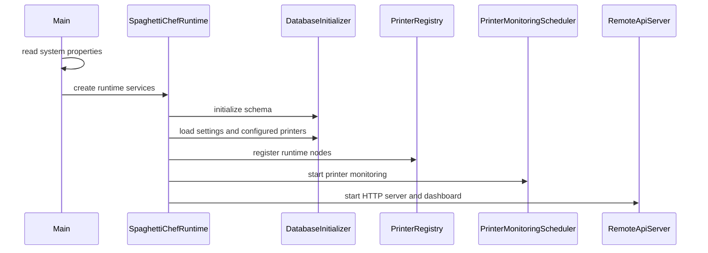
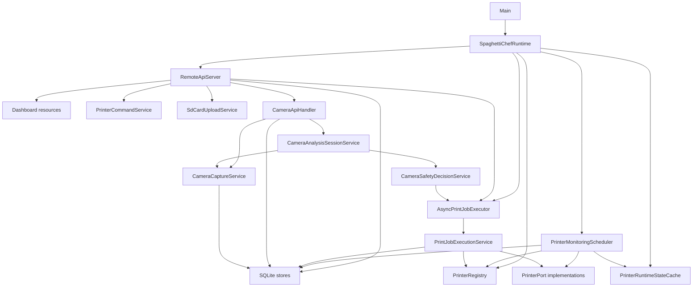
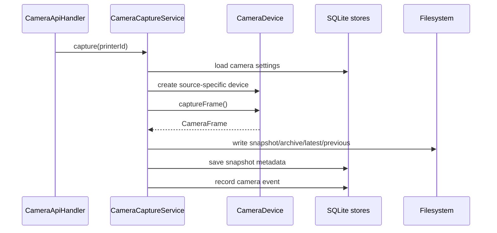

# SpaghettiChef Specification

This document describes the current technical design of SpaghettiChef.

For operator instructions, see [dashboard.md](dashboard.md). For endpoint details, see [rest-api.md](rest-api.md).

---

## Runtime Summary

SpaghettiChef is a local Java runtime for monitoring and controlling Marlin-compatible 3D printers.

It provides:

* embedded REST API
* embedded dashboard
* SQLite persistence
* background printer monitoring
* asynchronous job execution
* controlled serial command workflows
* print-file and SD-card upload management
* camera snapshot capture
* camera analysis sessions
* camera safety decision events
* local role/security settings
* operator audit events

The real-printer development reference is a Creality Ender-series Marlin workflow.

---

## Runtime Properties

| Property | Default | Purpose |
| --- | --- | --- |
| `spaghettichef.api.port` | `8080` | REST API and dashboard port |
| `spaghettichef.databaseFile` | `spaghettichef.db` | SQLite database file |
| `spaghettichef.monitoring.intervalSeconds` | `5` | printer monitoring interval |

Camera storage is not a startup property. It is a persisted per-printer camera setting.

The default camera storage setting is:

```text
camera
```

Relative camera storage paths resolve from the configured database directory. The capture service appends the safe printer id.

Example:

```text
database:         C:\spaghettichef\data\spaghettichef.db
camera setting:   camera
printer id:       p1
resolved folder:  C:\spaghettichef\data\camera\p1
```

---

## Startup Flow



Shutdown closes:

* API server
* background job executor
* monitoring scheduler
* printer registry/runtime nodes

---

## High-Level Architecture



---

## Logging

Runtime logs should use `SpaghettiChefLog` for new code.

Log format:

```text
2026-05-20T08:12:24.606088160Z [SpaghettiChef] INFO Default camera storage base: /tmp/example/camera
```

Current code still contains older direct `System.out`/`System.err` calls in some serial, job, and monitoring areas. New work should prefer `SpaghettiChefLog`.

Fixed message vocabulary and event names belong in `OperationMessages`.

---

## Persistence

SpaghettiChef uses SQLite.

The database file is selected by:

```text
-Dspaghettichef.databaseFile=<file>
```

Persisted data includes:

* printer configuration
* monitoring rules
* printer snapshots
* printer events
* camera settings
* camera events
* camera snapshot metadata
* camera analysis sessions
* camera analysis samples
* print-file settings
* print-file metadata
* printer-side SD file registry
* print jobs
* print job execution steps
* role profiles
* security settings
* operator audit events
* serial transfer settings

Schema initialization and additive migrations are handled by `DatabaseInitializer`.

---

## Printer Runtime Model

Configured printers are persisted and loaded into `PrinterRegistry`.

Runtime nodes use:

* `SerialConnection` / jSerialComm for real serial ports
* `SimulatedPrinterPort` for tests and local development

Printer state is cached in `PrinterRuntimeStateCache` and updated by monitoring.

---

## Monitoring

Monitoring is handled by:

* `PrinterMonitoringScheduler`
* `PrinterMonitoringTask`
* `MonitoringEventPolicy`

The scheduler polls enabled printers and records:

* latest printer snapshot
* state changes
* temperature changes
* errors
* disconnect/timeout events

Event deduplication and persistence behavior are controlled by monitoring settings.

---

## Jobs

Jobs are persisted domain objects.

Supported job behavior includes:

* create
* start asynchronously
* pause
* resume
* cancel
* restart from terminal print-file job
* delete
* inspect events
* inspect execution steps

`AsyncPrintJobExecutor` keeps API requests short by running job execution in the background.

`PrintJobExecutionService` owns controlled workflow execution and persists structured execution steps.

---

## Print Files And SD Upload

Host-side print files are represented separately from printer-side SD file targets.

Core services:

* `PrintFileService`
* `PrinterSdFileService`
* `SdCardService`
* `SdCardUploadService`

SD upload includes adaptive transfer behavior, recovery settings, progress status, and close-upload recovery.

---

## Camera Design

Camera implementation is behind the `CameraDevice` abstraction.

Current source types:

```text
disabled
simulated
snapshot-folder
ffmpeg
```

`FfmpegCameraDevice` is the first real webcam backend. It runs ffmpeg as a command process and captures one frame per request.

Examples:

```text
Windows dshow: sourceValue=video=PC-LM1E Camera, inputFormat=dshow
Linux v4l2:    sourceValue=/dev/video0, inputFormat=v4l2
```

Snapshot storage:

```text
<resolved camera base>/<safe printer id>/
  latest.jpg
  previous.jpg
  archive/
  snapshots/
```

Only metadata and paths are stored in SQLite. Image bytes stay on disk.

---

## Camera Capture Flow



---

## Camera Analysis Sessions

A camera analysis session is independent from print jobs.

It records a visual-analysis timeline for one printer:

```text
CameraAnalysisSession
  id
  printerId
  state
  startedAt
  stoppedAt
  createdAt
  updatedAt
  message
```

Each sample stores analysis data:

```text
CameraAnalysisSample
  capturedAt
  analyzedAt
  latestSnapshotPath
  previousSnapshotPath
  deltaSnapshotPath
  deltaScore
  changedPixelRatio
  averagePixelDelta
  confidence
  suspected
  reasonCodes
  message
```

Useful future graph series:

* X axis: `capturedAt`
* Y series: `confidence`
* Y series: `deltaScore`
* Y series: `changedPixelRatio`
* Y series: `averagePixelDelta`
* point state: `suspected`

---

## Camera Safety Decision Layer

Safety decision logic is separate from raw camera capture.

It can:

* persist suspected spaghetti events
* confirm repeated high-confidence detections
* optionally pause an active SD print through controlled job flow
* record safety action success/failure/skipped

Safety actions are disabled by default.

The camera code must not access serial communication directly.

---

## Security And Audit

Security settings are local.

The dashboard/API support:

* security enabled/disabled
* default role
* dangerous action confirmation
* role profiles
* operator audit events

State-changing API requests are audited where supported.

---

## Dashboard

Dashboard resources are static files served from:

```text
src/main/resources/dashboard
```

The browser UI uses JavaScript modules and relative API requests. It should not hardcode `localhost`, `8080`, or OS-specific paths.

---

## Main Technical Debt

Known cleanup targets:

* split `RemoteApiServer` into route handlers by domain
* finish moving direct console output to `SpaghettiChefLog`
* keep constants in `RuntimeDefaults` and `OperationMessages`
* keep orchestration classes free of duplicated message constants
* expand camera archive browsing API
* replace early camera analysis table with graph only after values are trusted
