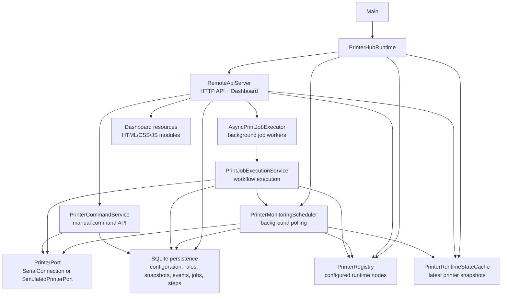
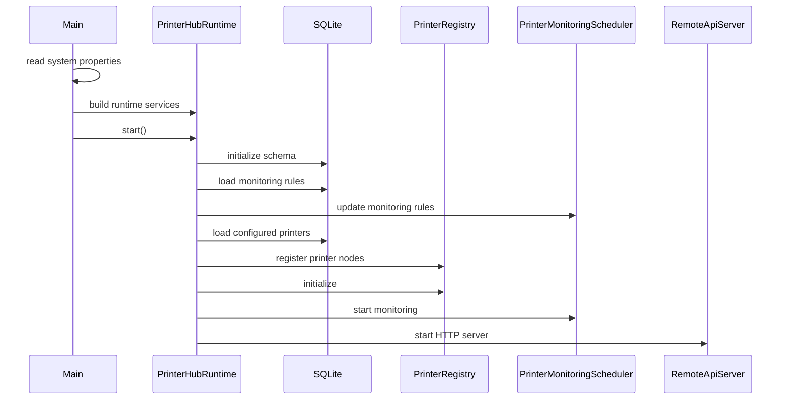
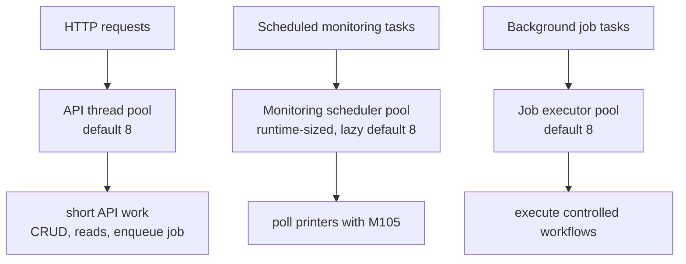
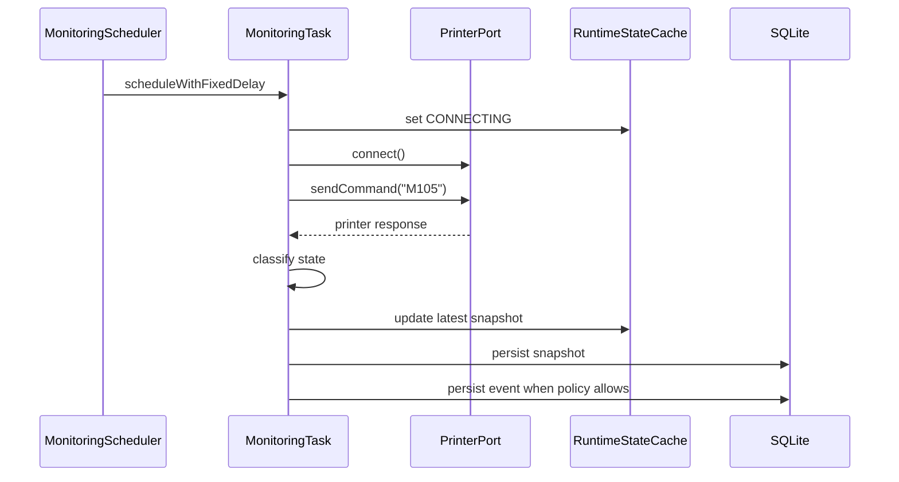
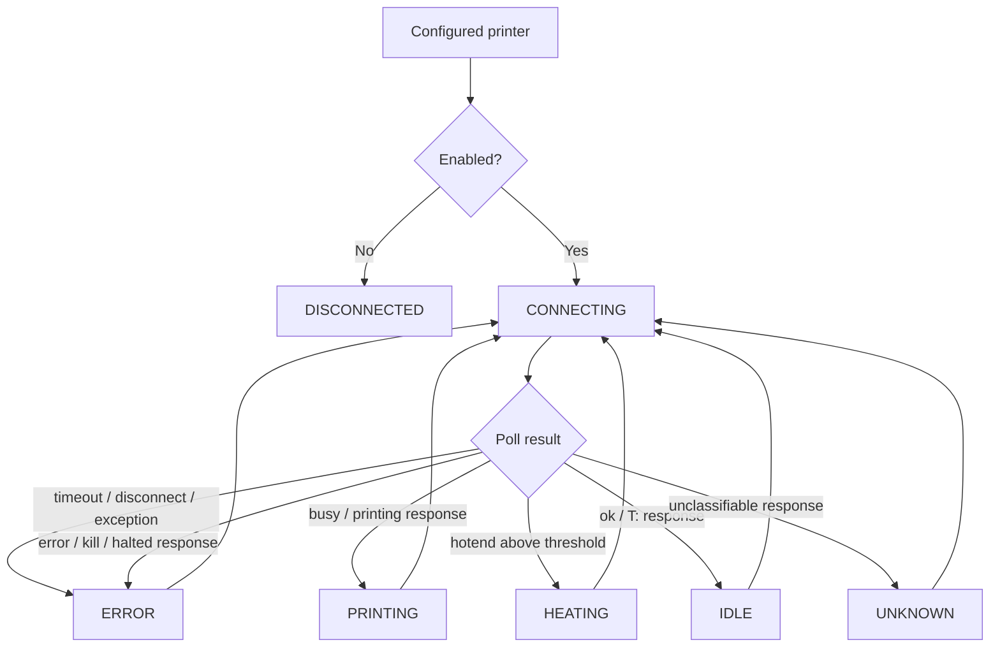
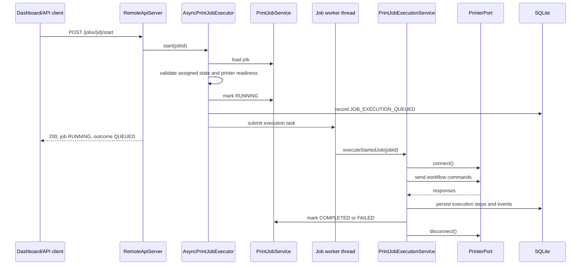
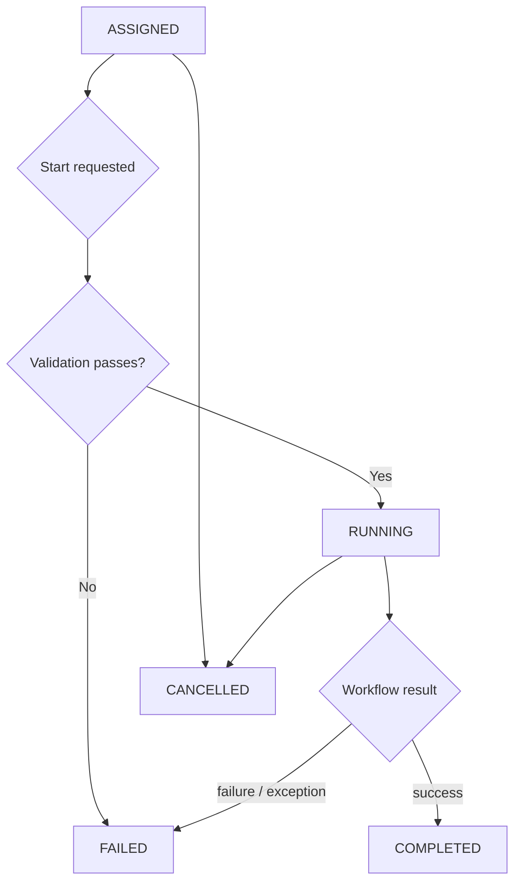
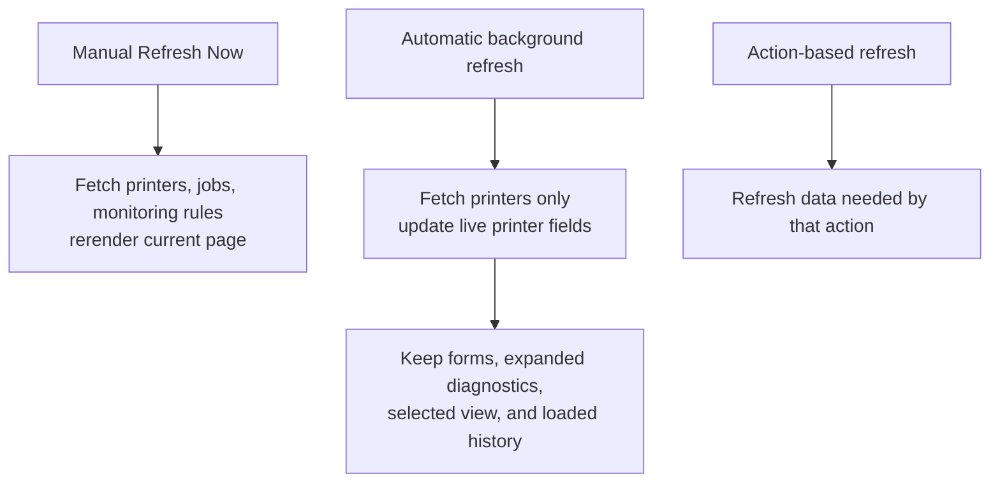
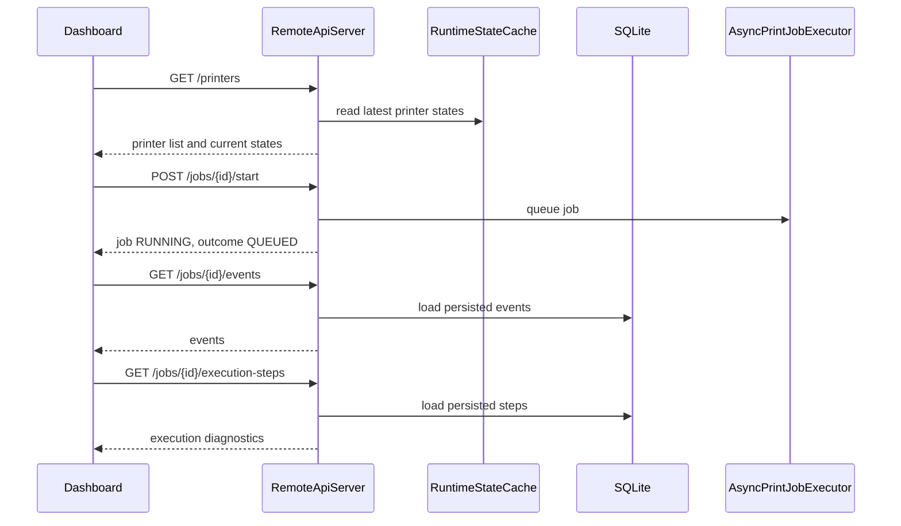

# PrinterHub Specification

This document describes the current PrinterHub solution.

It is intentionally limited to what exists now. It does not describe roadmap work or planned future features.

---

## Runtime Summary

PrinterHub is a local Java runtime for monitoring and controlling Marlin-compatible 3D printers over serial communication.

The runtime provides:

* embedded REST API
* embedded dashboard
* SQLite persistence
* background printer monitoring
* asynchronous job execution
* controlled printer commands and job workflows
* simulated printer ports for development and tests

The real-printer development reference is a Creality Ender-3 V2 Neo.

---

## Start Command

Run verification:

```bash
mvn clean verify
```

Start the local runtime:

```bash
mvn exec:java \
  -Dprinterhub.databaseFile="printerhub.db" \
  -Dprinterhub.api.port=18080 \
  -Dexec.mainClass="printerhub.Main"
```

Open the dashboard:

```text
http://localhost:18080/dashboard
```

Runtime properties:

| Property | Default | Purpose |
| --- | --- | --- |
| `printerhub.api.port` | `8080` | REST API and dashboard port |
| `printerhub.databaseFile` | `printerhub.db` | SQLite database file |
| `printerhub.monitoring.intervalSeconds` | `5` | monitoring poll interval |

---

## High-Level Architecture



---

## Startup Flow



Shutdown calls:

```text
RemoteApiServer.stop()
PrinterMonitoringScheduler.stop()
PrinterRegistry.close()
AsyncPrintJobExecutor.close()
```

---

## Backend

The backend is a Java application using:

* Java `HttpServer` for the REST API and dashboard resources
* SQLite through JDBC
* jSerialComm for real serial ports
* in-process simulated printer ports for tests and local development
* Maven for build and test execution

The API server uses a fixed request thread pool:

```text
DEFAULT_API_THREAD_POOL_SIZE = 8
```

The dashboard is served from:

```text
/dashboard
```

The main API areas are:

```text
GET    /health
GET    /printers
POST   /printers
GET    /printers/{id}
PUT    /printers/{id}
DELETE /printers/{id}
POST   /printers/{id}/enable
POST   /printers/{id}/disable
GET    /printers/{id}/status
GET    /printers/{id}/events
POST   /printers/{id}/commands
GET    /printers/{id}/sd-card/files

GET    /print-files
POST   /print-files
GET    /print-files/{id}

GET    /jobs
POST   /jobs
GET    /jobs/{id}
DELETE /jobs/{id}
POST   /jobs/{id}/start
POST   /jobs/{id}/cancel
GET    /jobs/{id}/events
GET    /jobs/{id}/execution-steps

GET    /settings/monitoring
PUT    /settings/monitoring
```

---

## Persistence

PrinterHub persists local runtime data in SQLite.

Persisted data includes:

* printer configuration
* monitoring rules
* printer snapshots
* printer events
* print-file metadata
* print jobs
* print job execution steps

The database file is selected by:

```text
-Dprinterhub.databaseFile=<file>
```

If no property is provided, the default file is:

```text
printerhub.db
```

---

## Threading Model

PrinterHub uses separate thread pools for separate responsibilities.



Default limits:

```text
API request thread pool: 8
Job executor pool:      8
Monitoring lazy pool:   8
Monitoring start pool:  max(1, configuredPrinterCount + 4)
```

Important behavior:

* API requests do not execute long jobs directly.
* `POST /jobs/{id}/start` queues a background job and returns quickly.
* The background job executor performs the long-running workflow.
* Each printer can have only one active job at a time.
* Monitoring is stopped for a printer while a job is executing on that printer, then restarted afterward if the printer is still enabled.

---

## Printer Monitoring

Enabled printers are monitored by `PrinterMonitoringScheduler`.

The scheduler creates a repeated `PrinterMonitoringTask` for each enabled printer.



Monitoring uses the configured polling interval.

The default status command is:

```text
M105
```

The dashboard reads the latest cached state. Normal dashboard reads do not poll printers directly.

---

## Printer State Machine

The observable printer state is stored in `PrinterRuntimeStateCache` as the latest `PrinterSnapshot`.



States:

```text
DISCONNECTED
CONNECTING
IDLE
HEATING
PRINTING
ERROR
UNKNOWN
```

Response classification:

```text
contains "error", "kill", or "halted" -> ERROR
contains "busy" or "printing"         -> PRINTING
hotend above heating threshold        -> HEATING
contains "ok" or "t:"                 -> IDLE
otherwise                             -> UNKNOWN
```

---

## Serial Access

Printer communication goes through the `PrinterPort` interface.

Implementations:

```text
SerialConnection        real serial port
SimulatedPrinterPort    simulated printer behavior
```

`SerialConnection` methods are synchronized:

```text
connect()
sendCommand(command)
disconnect()
isConnected()
```

This protects one `SerialConnection` instance from concurrent access.

Manual command execution also synchronizes on the printer port:

```text
synchronized (node.printerPort()) {
    connect
    send command
    disconnect
}
```

Job execution marks the printer node as busy with:

```text
PrinterRuntimeNode.beginJobExecution(jobId)
PrinterRuntimeNode.endJobExecution()
```

This prevents two jobs from executing on the same printer at the same time.

---

## Asynchronous Job Execution

Job start is asynchronous.



Job executor default:

```text
DEFAULT_JOB_EXECUTOR_POOL_SIZE = 8
```

Job states:

```text
CREATED
QUEUED
ASSIGNED
RUNNING
COMPLETED
FAILED
CANCELLED
```

Current start flow:

```text
ASSIGNED -> RUNNING -> COMPLETED
ASSIGNED -> RUNNING -> FAILED
ASSIGNED -> FAILED when rejected before background submission
ASSIGNED/RUNNING -> CANCELLED when cancelled through API
```

The `QUEUED` enum exists, but the current start flow marks the job `RUNNING` before submitting it to the background executor and records the queue moment as a `JOB_EXECUTION_QUEUED` event.

---

## Job Execution State Machine



Execution events include:

```text
JOB_CREATED
JOB_ASSIGNED
JOB_STARTED
JOB_EXECUTION_QUEUED
JOB_EXECUTION_STARTED
JOB_EXECUTION_IN_PROGRESS
JOB_EXECUTION_SUCCEEDED
JOB_EXECUTION_FAILED
JOB_COMPLETED
JOB_FAILED
JOB_CANCELLED
```

Execution diagnostics are persisted as workflow steps.

Each execution step can store:

* job id
* step index
* step name
* wire command
* response
* outcome
* success flag
* failure reason
* failure detail

---

## Controlled Job Actions

Current controlled job types:

```text
READ_TEMPERATURE
READ_POSITION
READ_FIRMWARE_INFO
HOME_AXES
SET_NOZZLE_TEMPERATURE
SET_BED_TEMPERATURE
SET_FAN_SPEED
TURN_FAN_OFF
PRINT_FILE
```

The job workflow layer maps semantic job types to wire commands.

Examples:

```text
READ_FIRMWARE_INFO -> M115
READ_TEMPERATURE   -> M105
READ_POSITION      -> M114
HOME_AXES          -> M114, then G28
PRINT_FILE         -> represented/prepared metadata step, no G-code sent
```

Responses are classified into success or failure by the job response classifier.

For long-running commands such as `G28`, the serial read timeout is longer than normal commands. Busy responses such as `echo:busy: processing` are treated as in-progress information, not as final success by themselves.

---

## Dashboard Solution

The dashboard is served by the backend from:

```text
/dashboard
```

Current frontend files:

```text
src/main/resources/dashboard/
├── index.html
├── dashboard.css
├── dashboard.js
├── api.js
├── state.js
├── components/
└── views/
```

`dashboard.js` is the entrypoint.

`api.js` uses relative URLs such as:

```text
/printers
/jobs
/settings/monitoring
```

Because of this, the dashboard follows the API port that served it.

Dashboard navigation:

```text
PrinterHub
├── Farm Home
├── Printers
├── Jobs
├── History
└── Settings

Selected Printer
├── Home
├── Print
├── SD Card
├── Prepare
├── Control
├── Info
└── History
```

Dashboard refresh behavior:



Automatic refresh does not rerender the whole dashboard. It updates live printer fields only:

* state
* temperatures
* last response
* error message
* updated timestamp

---

## Dashboard/API Data Flow



---

## Current Boundaries

PrinterHub currently does not perform slicing, model conversion, or G-code editing.

Current jobs are controlled command/workflow jobs and represented file-backed `PRINT_FILE` jobs.

The dashboard can register existing host-side `.gcode` paths, upload `.gcode` files into the configured print-file storage directory, select print files for `PRINT_FILE` jobs, and show the file content read-only from a job card. The runtime does not transfer or stream those files to a printer in this version.

All persistence is local SQLite.

The current runtime is local-first; there is no central server/farm federation in the implementation described here.
